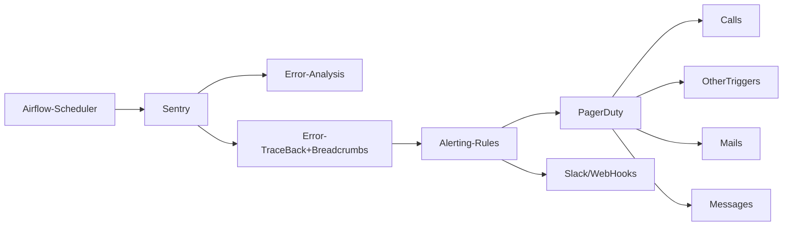
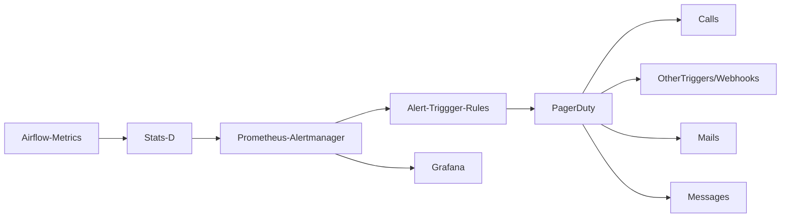

#### Materials and Links for all my talks/presentations. Each talk/presentation has a seperate branch

* PyData Delhi Meetup 2019
* GDG Dehil DevFest 2019

# Application Monitoring Tech @ ATLAN 

### Problem Statement
* Have one source of truth for all application errors.
* Ability to have actionable alerts corresponding to different errors. Actionable is not limited to being informative but also ability to receive notification using calls/emails and take actions example assignment, generating jira error tickets
* Create analysis around issues to priorities on occurrence and number of users/services affected.
* Scalability to support multiple clients and multiple teams.

### Present Alerting Setup for Airflow
DAG failure alerts are triggered by a function callback defined in an athena node 
* Cons
	* Errors are dependent upon node run, for cases where the airflow-scheduler has failed no errors would be logged leading us to belief falsely that the workflows are working fine.
	* For cases where the task instance fails but is successful in retries wrong alerts for failure are sent.
* Pros
	* The information delivered to slack is highly informative, with the provision to look at the workflow-run and the corresponding airflow-run.
	
### Proposed Alerting Setup

Setting up **sentry** as our one source of truth for application errors. Sentry provides services for error:
* Collection
* Monitoring
* Taking followup actions when errors occur.

The following feature of **sentry** help solve the above mentioned problem  statement
-   Analysis around errors, how often they happen, what services are affected.
-   Ability to know what’s breaking and how to reproduce the problem using **Breadcrums** which is a trail of events which happened prior to an issue. Often times these events are very similar to traditional logs, but also have the ability to record more rich structured data.
-   Ability to view actual code in stack traces, including support for source maps.
-   See the error’s url, parameters, and session information.
-   Filter noisy traces with app, framework, and raw error views.
- Ability to create different workspace for different teams and clients. 
-  Ability to trigger integration like email, sms, slack or multiple integration like pagerDuty, trello etc

**Sentry@airflow** records all error events from the airflow scheduler and at DAG level including error tracebacks and it gets relevant tags related to the workflow `dag_id, execution_date, task_id, server_name, run_id` . The information extracted about the workflow is configurable and hence rich information about the workflow can be delivered

### Alerting Setup for Infra

### Stats-D
Is a simple [daemon](https://www.webopedia.com/TERM/D/daemon.html) developed in order to aggregate and summarize application metrics. StatsD is a push-based monitoring system where it receives metric logs from an application and push them to somewhere else such as ElasticSearch or InfluxDB for example. From an application, like Airflow, the developer has produce the metrics he/she wants to capture. Basically, StatsD has multiple metric types which are:
* **Counters**: simple counter, increase or decrease a number. At each flush the current count is sent and reset to 0. StatsD sends both the rate and the count at each flush.
* **Timing Summary Statistics**: gives the time for something to finish. StatsD figures out percentiles, average (mean), standard deviation, sum, lower and upper bounds for the flush interval. For each percentile threshold, the mean, upper and sum is computed.
* **Gauges**: takes an arbitrary value assigned to it and maintains that value until it is next set. Adding a sign to the gauge value will change it rather than setting it.
* **Sets**: use to count unique occurrences of events between flushes.

**@Derived from [Apache Airflow monitoring with TIG](https://marclamberti.com/blog/apache-airflow-monitoring-with-tig-part-1/)**

### Prometheus-Alertmanager
[Prometheus](https://prometheus.io/) is an open source monitoring tool based on the pull-based mechanism **(pulls metrics from statsd in case of airflow)** which helps in scraping data, query it, create a dashboard using it and provide alerts based on alert rules. Prometheus has a main central component named Prometheus Server. Prometheus server scrapes targets over an interval to collect metrics and store them in time-series database. We can make PromQL queries for this data to get metrics for a specific target. Prometheus also has an alert manager component to send alerts via email, slack or other alerting tools. We can define rules which Prometheus server reads and fire alert when defined condition triggers.
[AlertManager](https://prometheus.io/docs/alerting/alertmanager/) Handles alerts sent by Prometheus server and notifies end user.
Alerting in Prometheus is separated into two parts. First, Alert rules are defined in Prometheus configuration. If any alert condition hits, Prometheus send alert to AlertManager. Second, AlertManager manages alerts through its pipeline of silencing, inhibition, grouping and sending out notifications. Silencing is to mute alerts for a given time. Alerts are checked to match against active silent alerts, if a match is found then no notifications are sent. Inhibition is to suppress notifications for certain alerts if other alerts are already fired. Grouping group alerts of similar nature into a single notification. This helps prevent firing multiple notifications simultaneously.
**@Derived from [Prometheus with Alertmanager](https://itnext.io/prometheus-with-alertmanager-f2a1f7efabd6)**

**[Difference between Prometheus and Sentry](https://stackshare.io/stackups/prometheus-vs-sentry)**

### Grafana
A multi-platform open source analytics and interactive visualization software. It provides charts, graphs, and alerts for the web when connected to supported data sources. It is expandable through a plug-in system

### PagerDuty
Is an incident management platform that provides reliable notifications, automatic escalations, on-call scheduling, and other functionality to help teams detect and fix infrastructure problems quickly.

